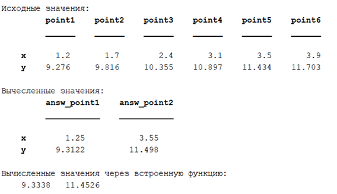

# Interpolation MATLAB
Interpolating a function using Lagrange formulas.

---
## Оглавление
* <a href="#1">Описание метода численной реализации задания</a>
* <a href="#2">__Описание ручного счета тестового примера предложенным методом__</a>	
* <a href="#3">__Разработка алгоритмов решения задачи__</a>	
* <a href="#4">__Проверка корректности ввода__</a>
* <a href="#5">__Результат работы программы__</a>
* <a href="#6">__Результат реализации метода с помощью встроенных функций__</a>

---

## <a id="1">Описание метода численной реализации</a>	 

Интерполяционный многочлен Лагранжа — многочлен минимальной степени, принимающий заданные значения в заданном наборе точек, то есть решающий задачу интерполяции. Ж. Л. Лагранж предложил следующий способ вычисления таких многочленов (1).

$$P(x)=\sum\limits_{i=0}^n y_il_i(x), (1)$$

Где базисные полиномы $l_i$ определяются по формуле (2):

 =%5Cprod_%7Bj=0,j%5Cneq%20i%7D%5E%7Bn%7D=%5Cfrac%7Bx-x_j%7D%7Bx_i-x_j%7D=%5Cfrac%7Bx-x_0%7D%7Bx_i-x_0%7D...*%5Cfrac%7Bx-x_%7Bi-1%7D%7D%7Bx_i-x_%7Bi-1%7D%7D*%5Cfrac%7Bx-x_%7Bi&plus;1%7D%7D%7Bx_i-x_%7Bi&plus;1%7D%7D*%5Cfrac%7Bx-x_n%7D%7Bx_i-x_n%7D)

После чего получается интерполяционный многочлен Лагранжа, в который можно подставить в место x значение, нужно для вычисления функции.

## <a id="2">Описание ручного счета тестового примера предложенным методом</a>	

Исходные данные:

| $x_n$ | 1.2 | 1.5 | 1.7 | 2.0 | 2.4 | 2.6 | 3.1 | 3.3 | 3.5 | 3.9 |
| -- | -- | -- | -- | -- | -- | -- | -- | -- | -- | -- |
|$f(x_n)$| 9,276 | 9,549 | 9,816 | 10,088 | 10,355 | 10,622 | 10,897 | 11,160 | 11,434 | 11,703 |

Найти значение функции в точках: $x = 1.25, x = 3.55$.
Для упрощения подсчетов я взял только 3 числа из исходной таблицы:

| $x_n$ | 1.2 | 2.6 | 3.9 |
| -- | -- | -- | -- |
| $f(x_n)$ | 9,276 | 10,622 | 11,703 |

Вычисление базисных полиномов по формуле (2):

$$l(1.2)=\frac{(x-2.6)(x-3.9)} {(1.2-2.6)(1.2-3.9)}=\frac{50x^2-325x+507}{189}$$

$$l(2.4)=\frac{(x-1.2)(x-3.9)} {(2.6-1.2)(2.6-3.9)}=-\frac{50x^2-255x+234}{91}$$

$$l(3.9)=\frac{(x-1.2)(x-2.6)} {(3.9-1.2)(3.9-2.6)}=\frac{100x^2-380x+312}{351}$$

Нахождение многочлена Лагранжа по формуле (1):

 =9,276*l(1.2)&plus;10,622*l(2.4)&plus;11,703*l(3.9)=\frac{-19700x^2&plus;468565x&plus;3264612}{409500})

Подставляем значения 1.25 и 3.55 в полученный многочлен:

$$L(1.25)=9.327$$

$$L(3.55)=11.428$$

## <a id="3">Разработка алгоритмов решения задачи</a>	

Входные данные для этого алгоритма:
* Массивы значений X и Y;
* Точки, в которых необходимо посчитать значение функции;

Ниже на рисунке 1 предоставлен алгоритм нахождения значения функции в точке с помощью интерполяционного многочлена Лагранжа.

 Рисунок 1

## <a id="4">Проверка корректности ввода</a>

В данной программе пользователь вводит пару значений $(x, y)$, они проверяются на корректность и сортируются по $x$ по возрастанию. Если пользователь вводит одинаковые числа $x$, программа сообщает об ошибке и просит ввести значения заново. Кроме того, выполняется проверка на вхождение в диапазон значений X для точек, указанных пользователем. Результат показан на рисунке 2.

 Рисунок 2

## <a id="5">Результат работы программы</a>

На рисунке 3 представлен результат работы демоверсии программы.

 Рисунок 3

На рисунке 4 представлен график построенной функции. Точки, в которых нужно было посчитать значение на графике обозначены жёлтыми кружками.

 Рисунок 4

На рисунке 5 результат работы программы с возможностью пользовательского ввода. 

 Рисунок 5

На рисунке 6 представлен график функции для программы с пользовательским вводом.

 Рисунок 6

## <a id="6">Результат реализации метода с помощью встроенных функций</a>

В Matlab для нахождения значений функции в заданных точках с помощью интерполяционного многочлена Лагранжа доступны встроенные функции "polyfit" и "polyval". Результат работы программы с использованием этих функций совпадает с результатом, получаемым при использовании соответствующих встроенных функций Matlab. Результат показан на рисунке 7.

 Рисунок 7
